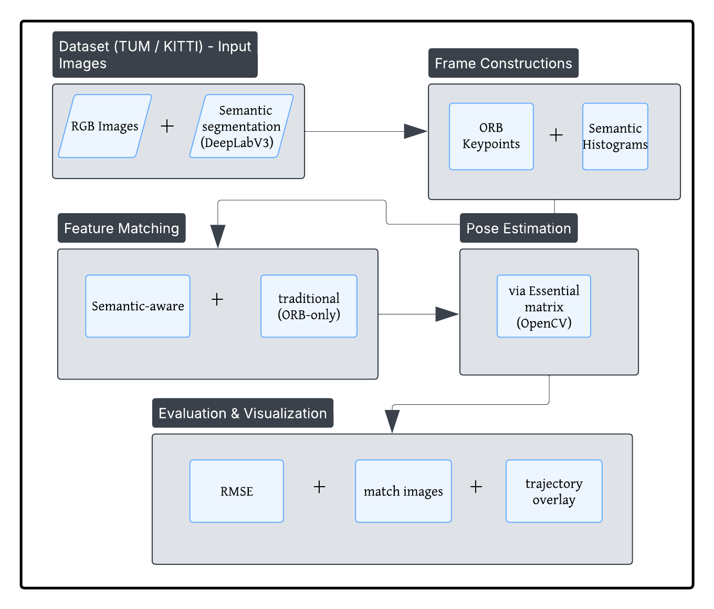

# Semantically Guided Feature Matching for Visual SLAM



This repository contains the implementation of a semantically guided feature matching method for Visual SLAM, enhancing the traditional ORB-SLAM2 pipeline by integrating semantic information into the feature matching process. By leveraging semantic segmentation, the system aims to improve feature correspondence accuracy, especially in dynamic or ambiguous environments.

## 📄 Table of Contents

- [Overview](#overview)
- [Features](#features)
- [Prerequisites](#prerequisites)
- [Installation](#installation)
- [Usage](#usage)
- [Dataset Preparation](#dataset-preparation)
- [Results](#results)
- [Project Structure](#project-structure)
- [Acknowledgements](#acknowledgements)
- [License](#license)

## 📌 Overview

Traditional Visual SLAM systems, like ORB-SLAM2, rely solely on visual descriptors for feature matching, which can lead to inaccuracies in environments with repetitive textures or dynamic objects. This project introduces semantic descriptors, obtained from pre-trained segmentation networks, into the feature matching process. By constructing semantic histograms around each keypoint and filtering out semantically inconsistent matches, the system enhances robustness and accuracy.

## ✨ Features

- **Semantic Descriptor Integration**: Combines ORB descriptors with semantic histograms for each keypoint.
- **Semantic Filtering**: Discards feature matches with low semantic similarity to reduce false correspondences.
- **Enhanced Loop Closure**: Incorporates semantic cues to improve loop closure detection and prevent false positives.
- **Support for Multiple Datasets**: Tested on TUM RGB-D and KITTI datasets.
- **Detector Agnostic**: Compatible with different feature detectors, including SuperPoint.

## 🛠️ Prerequisites

- **Operating System**: Ubuntu 18.04 or later
- **Python**: 3.6 or later
- **C++ Compiler**: GCC 7.5 or later
- **Libraries**:
  - OpenCV
  - Eigen3
  - Pangolin
  - PyTorch
  - ROS (optional, for integration)
- **Hardware**:
  - NVIDIA GPU with CUDA support (for semantic segmentation)

## 🚀 Installation

1. **Clone the Repository**:

   ```bash
   git clone https://github.com/annadurai-ka/Semantically_guided_slam.git
   cd Semantically_guided_slam


2. **Build the Project**:

   ```bash
   mkdir build
   cd build
   cmake ..
   make -j8
   ```

3. **Set Up Python Environment**:

   ```bash
   python3 -m venv venv
   source venv/bin/activate
   pip install -r requirements.txt
   ```

   *Ensure that PyTorch is installed with CUDA support.*

## 📈 Usage

1. **Prepare the Dataset**: Ensure that the dataset is organized as specified in the [Dataset Preparation](#dataset-preparation) section.

2. **Run the System**:

   ```bash
   ./main <path_to_dataset>
   ```

   Replace `<path_to_dataset>` with the path to your dataset directory.

## 📂 Dataset Preparation

Organize your dataset directory as follows:

```
dataset/
├── images/
│   ├── frame_0001.png
│   ├── frame_0002.png
│   └── ...
├── semantic_images/
│   ├── frame_0001.png
│   ├── frame_0002.png
│   └── ...
├── config.txt
└── groundtruth.txt
```

- **images/**: Contains the RGB images.
- **semantic_images/**: Contains the corresponding semantic segmentation masks.
- **config.txt**: Configuration file specifying parameters.
- **groundtruth.txt**: Ground truth poses in TUM format.

*Ensure that the filenames in `images/` and `semantic_images/` correspond exactly.*

## 📊 Results

The system was evaluated on sequences from the TUM RGB-D and KITTI datasets. Key findings include:

- **Improved Feature Matching**: Semantic filtering reduced false matches, especially in dynamic scenes.
- **Enhanced Trajectory Accuracy**: Slight improvements in rotation and translation RMSE were observed.
- **Robust Loop Closure**: Semantic cues helped prevent false loop closures in visually similar but semantically different scenes.

For detailed results and analysis, refer to the [report](report.pdf) included in this repository.

## 📁 Project Structure

```
Semantically_guided_slam/
├── assets/
│   └── architecture_diagram.png
├── build/
├── src/
│   ├── main.cpp
│   ├── semantic_descriptor.cpp
│   └── ...
├── scripts/
│   └── run_segmentation.py
├── datasets/
│   └── ...
├── report.pdf
├── requirements.txt
├── CMakeLists.txt
└── README.md
```

- **assets/**: Contains images and diagrams.
- **build/**: Directory for build files.
- **src/**: C++ source code.
- **scripts/**: Python scripts for preprocessing and segmentation.
- **datasets/**: Sample datasets for testing.
- **report.pdf**: Detailed project report.
- **requirements.txt**: Python dependencies.

## 🙏 Acknowledgements

- [ORB-SLAM2](https://github.com/raulmur/ORB_SLAM2)
- [Mask R-CNN](https://github.com/matterport/Mask_RCNN)
- [SuperPoint](https://github.com/magicleap/SuperPointPretrainedNetwork)
- [TUM RGB-D Dataset](https://vision.in.tum.de/data/datasets/rgbd-dataset)
- [KITTI Dataset](http://www.cvlibs.net/datasets/kitti/)

## 📄 License

This project is licensed under the [MIT License](LICENSE).

---

*For any queries or contributions, feel free to open an issue or submit a pull request.*
```

---

Feel free to customize this README further to match any specific details or updates related to your project. 
